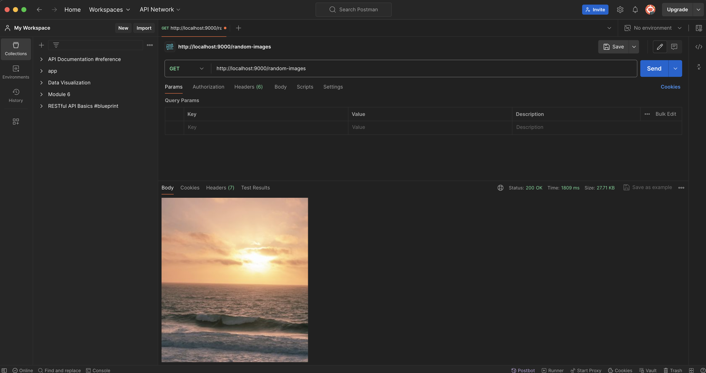

# Random Image API

This project is a Node.js application that generates a random image from Unsplash, resizes it, and sends it to the client. It utilizes the following technologies:

- `Express`: A web framework for Node.js.
- `Axios`: A promise-based HTTP client for making requests.
- `Sharp`: An image processing library.
- `Dotenv`: A module to load environment variables from a .env file.

## Screenshort


## Features

- Fetches a random image from Unsplash.
- Resizes the image to a width of 350 pixels.
- Returns the resized image to the client.

## Prerequisites

- Node.js (v12 or higher)
- npm (v6 or higher)

## Installation

1. Clone the repository:

    ```sh
    git clone https://github.com/Lovenoelkujur/random-image-api.git
    cd random-image-generator
    ```

2. Install the dependencies:

    ```sh
    npm install
    ```

3. Create a `.env` file in the root of the project and add your API keys:

    ```sh
    UNSPLASH_ACCESS_KEY=your_unsplash_access_key
    ```

## Usage

1. Start the server:

    ```sh
    npm start
    ```

2. Once the server is running, you can make a GET request to the /random-images endpoint to receive a resized random image from Unsplash. Here's an example using:

    ```sh
    http://localhost:9000/random-images
    ```
This command will save the received image as random_image.png.

## API Endpoints

#### GET /random-images 

Fetches a random image from Unsplash, resizes it to a width of 350 pixels, and returns it as a PNG image.

`Responses`:

- `200 OK`: The resized image is returned.
- `500 Internal Server Error`: An error occurred while processing the request.

#### / (Wildcard Route)*

Catches all undefined routes and returns a 404 error.

`Response`:

- `404 Not Found`: The requested resource does not exist.

## Error Handling
The application includes basic error handling. If an error occurs while fetching or processing the image, a 500 Internal Server Error response is sent with a JSON message.

- `500 Internal Server Error` on failure
  ```json
  {
     "error": "Internal server error occured"
  }

- 404 Not Found
  ```json
  {
    "message": "PAGE NOT FOUND"
  } 

## Environment Variables

- `UNSPLASH_ACCESS_KEY` : your_unsplash_access_key


## Dependencies
- `dotenv` : Loads environment variables from a `.env` file into `process.env`. 

- `express`: Fast, unopinionated, minimalist web framework for Node.js.

- `axios`: Promise based HTTP client for the browser and node.js.

- `Unsplash`: Providing the API to fetch random images.

- `Sharp`: The image processing capabilities.

```perl

Make sure to replace `yourusername` in the clone URL with your actual GitHub username if you plan to use the URL provided. Also, ensure you have your API keys ready and properly set in the `.env` file.
```

## License
This project is licensed under the MIT License.
